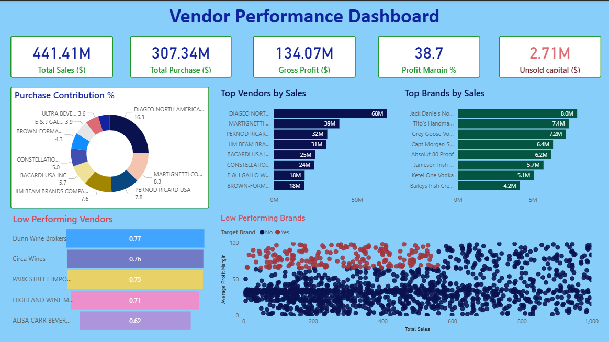

# 📊 Vendor Performance Analysis – Capstone Project

## 📌 Project Overview

This project focuses on analyzing vendor performance using real-world purchase and supplier data.
The goal is to evaluate suppliers based on delivery, quality, and cost efficiency to help businesses make data-driven decisions when managing vendors.

The workflow includes:

1. **Data Ingestion** – Multiple raw files are uploaded and stored in a local SQLite database.
2. **Data Processing** – Data is cleaned, merged, and transformed into a final dataset for analysis.
3. **Exploratory Data Analysis (EDA)** – Trends, distributions, and relationships are explored.
4. **Dashboard Creation** – An interactive **Power BI Dashboard** is built for insights.

---

## 🗂️ Dataset

* **Source**: 6 different CSV files (purchases, suppliers, etc.)
* **Storage**: SQLite local database
* **Final Dataset**: A single consolidated file used for EDA and dashboard

📂 **Project Data Folder (available in this repo):**

* `purchases.csv`
* `suppliers.csv`
* `products.csv`
* `final_dataset.csv`

☁️ **Additional Large Files (hosted on Google Drive):**

* `purchases.csv`
* `sales.csv`
* `vendor_sales_summary.csv`

👉 [Click here to access the additional datasets](https://drive.google.com/drive/folders/1ZPUa_nslY8xdZuBbnnJ5OJfafwMmnjEe?usp=sharing)

---

## ⚙️ Tech Stack

* **Python** 🐍

  * pandas, numpy – data cleaning & transformation
  * sqlite3 – database connection
  * matplotlib, seaborn – EDA visualization

* **SQL** 🗄️

  * Database setup & queries

* **Power BI** 📊

  * Interactive dashboard for business insights

---

## 🚀 Project Workflow

### 1. Data Ingestion

* Python script (`ingestion_db.py`) loads all raw files into SQLite database.

### 2. Data Cleaning & Processing

* Handled missing values, duplicates, and formatting.
* Joined datasets into one **final consolidated dataset**.

### 3. Exploratory Data Analysis

* Vendor performance distribution
* Top vendors by purchase value
* Late vs on-time delivery analysis
* Cost & quality trends

### 4. Power BI Dashboard

* KPIs: On-time delivery %, Quality rating, Purchase trends
* Visuals: Trend charts, bar plots, slicers, vendor comparison

---

## 📸 Dashboard Preview



---

## 📂 Repository Structure

```
Vendor-Performance-Analysis-Capstone-Project/
│-- data/                  
│   │-- purchases.csv
│   │-- suppliers.csv
│   │-- products.csv
│   │-- final_dataset.csv
│
│-- ingestion_db.py        
│-- data_processing.py     
│-- eda.ipynb              
│-- dashboard.pbix         
│-- README.md              
```

🔗 Large dataset files: [Google Drive Link](https://drive.google.com/drive/folders/1ZPUa_nslY8xdZuBbnnJ5OJfafwMmnjEe?usp=sharing)

---

## 📈 Key Insights

* Identified top-performing vendors in terms of **quality and timely delivery**.
* Found patterns in **cost inefficiencies** across certain suppliers.
* Built an interactive dashboard for **quick business decisions**.

---

## 👨‍💻 Author

**Mangal Singh**

* [GitHub](https://github.com/mangal-singh001)
* [LinkedIn](https://www.linkedin.com/in/mangal-singh123/)

---

✨ *This project helped me strengthen my skills in Python, SQL, and Power BI while solving a real-world business problem.*

---
